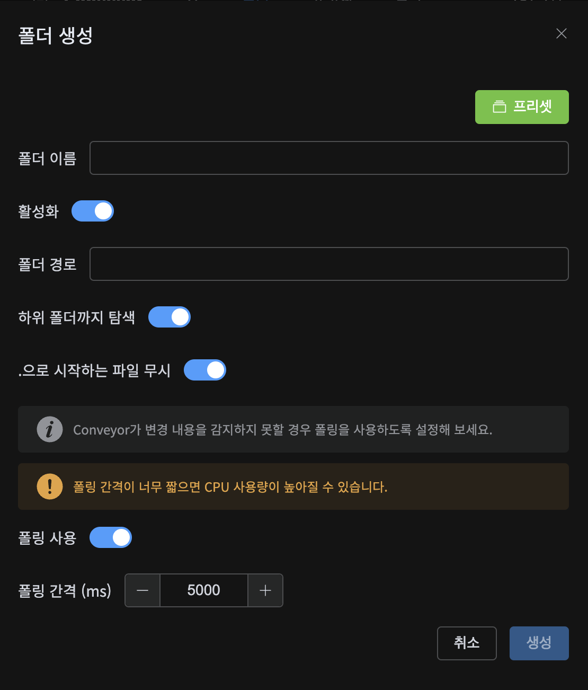
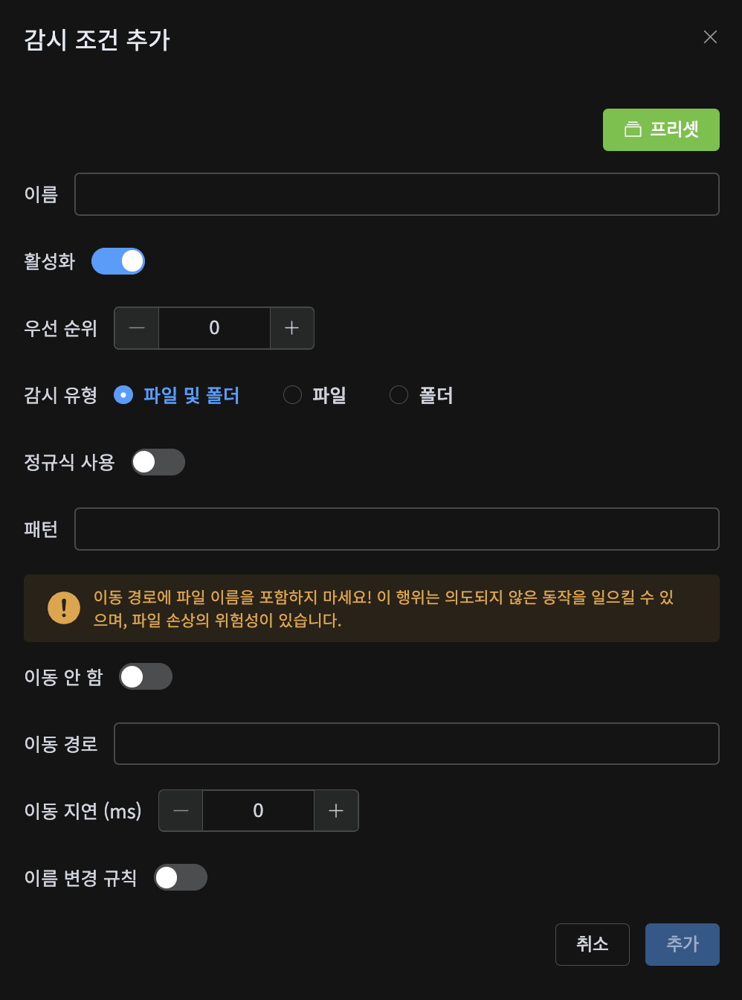
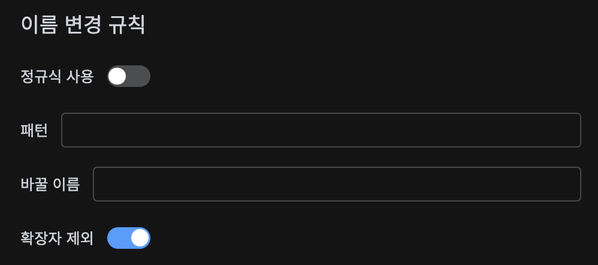

<p align="center">
  
  
</p>
<p align="center" style="font-size: 2rem;">Conveyor</p>
<p align="center">파일 관리 자동화 도구</p>

## 소개

Conveyor는 파일 관리 자동화 도구입니다. Conveyor를 사용하면 사용자가 지정한 규칙에 따라 다운로드한 파일을 자동으로 이동시키거나, 파일 이름을 변경할 수 있습니다.

## 설치

Conveyor는 Docker(Docker Compose)를 통한 사용을 권장합니다. Docker를 사용하지 않고 사용하는 방법은 [여기](#docker-없이-사용하기)를 참고하세요.

### Docker

아래 명령어를 사용하여 Docker를 통해 Conveyor를 실행할 수 있습니다.

```bash
docker run -d \
    --name conveyor \
    --restart unless-stopped \
    -p 3000:3000 \
    -e TZ=Asia/Seoul \
    [-e <ENV_VARIABLE>=<VALUE>] \
    -v /path/to/config:/conveyor/config \
    [-v /path/to/anywhere:/anywhere] \
    alanimdeo/conveyor:latest
```

- `ENV_VARIABLE`: 환경 변수를 설정합니다. 아래 [환경 변수](#환경-변수)를 참고하세요.
- `/path/to/config`: Conveyor의 설정 파일을 저장할 경로입니다. 설정하지 않을 경우 업데이트/컨테이너 재생성 시 설정이 초기화될 수 있습니다.
- `/path/to/anywhere`: Conveyor가 파일을 감시하거나 이동시킬 경로입니다.

### Docker Compose

`docker-compose.yml`:

```yaml
services:
  conveyor:
    image: alanimdeo/conveyor:latest
    container_name: conveyor
    environment:
      - TZ=Asia/Seoul
      # - <ENV_VARIABLE>=<VALUE>
    ports:
      - 3000:3000
    volumes:
      - ./config:/conveyor/config
      # - /path/to/anywhere:/anywhere
    restart: unless-stopped
```

```bash
docker compose up -d
```

### 환경 변수

환경 변수를 통해 포트 등 컨테이너의 몇몇 설정들을 변경할 수 있습니다.

| 이름                | 기본값                             | 설명                                                                                            |
| ------------------- | ---------------------------------- | ----------------------------------------------------------------------------------------------- |
| `PORT`              | `3000`                             | Conveyor Web UI의 포트를 설정합니다.                                                            |
| `TZ`                | `Etc/UTC`                          | 컨테이너의 시간대를 설정합니다. 로그 페이지의 시간 기록에 영향을 미칩니다.                      |
| `DB_FILE`           | `/conveyor/config/database.sqlite` | Conveyor의 데이터베이스 파일을 설정합니다. 컨테이너 내부의 절대경로로 지정하는 것을 권장합니다. |
| `SESSION_SECRET`    | 무작위 값                          | 로그인 세션의 비밀 키를 설정합니다. 미설정 시 컨테이너를 시작할 때 무작위 값으로 설정됩니다.    |
| `COOKIE_EXPIRATION` | `1800000` (30분)                   | 로그인 세션의 만료 시간을 설정합니다. 단위는 밀리초입니다.                                      |

### Docker 없이 사용하기

이 방법은 권장되지 않으나 Windows 환경에서 Docker를 사용할 수 없는 경우 사용할 수 있습니다.

사용 방법은 추후 작성 예정입니다.

## 사용 방법

컨테이너를 실행한 후, 웹 브라우저에서 `http://<IP>:3000`에 접속하여 Conveyor를 사용할 수 있습니다.

첫 실행 시 ID는 `admin`, 비밀번호는 `changeme`입니다. 로그인 후 오른쪽 상단의 톱니바퀴 버튼을 눌러 ID와 비밀번호를 변경할 수 있습니다.

### 폴더


감시할 폴더를 추가합니다.

- **폴더 경로**: 감시할 폴더의 경로를 입력합니다. 경로는 컨테이너 내부의 절대경로로 입력해야 합니다.
- **하위 폴더까지 탐색**: 감시 폴더 내의 모든 하위 폴더를 감시합니다.
- **.으로 시작하는 파일 무시**: 파일 이름이 `.`으로 시작하는 파일을 무시합니다.
- **폴링 사용**: 폴더를 감시할 때 폴링을 사용합니다. 네트워크 드라이브 등 폴더 감시가 제대로 되지 않는 경우에 사용할 수 있지만, CPU 사용량이 높아질 수 있습니다.

### 감시 조건


감시 조건을 추가합니다.

- **우선 순위**: 감시 조건의 우선 순위를 설정합니다. 낮은 숫자일수록 먼저 검사합니다.
- **정규식 사용**: 파일의 이름을 검사할 때 정규 표현식을 사용합니다. 사용하지 않을 경우 파일 이름이 패턴 문자열을 포함하는지 검사합니다.
- **패턴**: 검사할 파일 이름의 패턴을 입력합니다.
- **이동 경로**: 파일을 이동시킬 경로를 입력합니다. **파일의 이름을 변경하고자 하는 경우 이름 변경 규칙을 사용하세요!** 이동 경로에 파일 이름을 포함하는 경우 의도되지 않은 동작을 일으킬 수 있습니다.
- **이동 지연**: 파일을 이동시키기 전 기다릴 시간을 입력합니다.



- **이름 변경 규칙**: 패턴에 입력된 문자열을 바꿀 이름으로 대치합니다. 정규식을 사용할 수 있으며, 파일 이름에 상관없이 고정된 이름으로 변경하고자 하는 경우 정규식 사용을 켜고 패턴에 `.*`를 사용할 수 있습니다.

### 프리셋

자주 사용하는 감시 폴더/조건 설정을 프리셋으로 저장할 수 있습니다. 저장한 프리셋은 감시 폴더/조건 설정에서 으로 불러올 수 있습니다.
